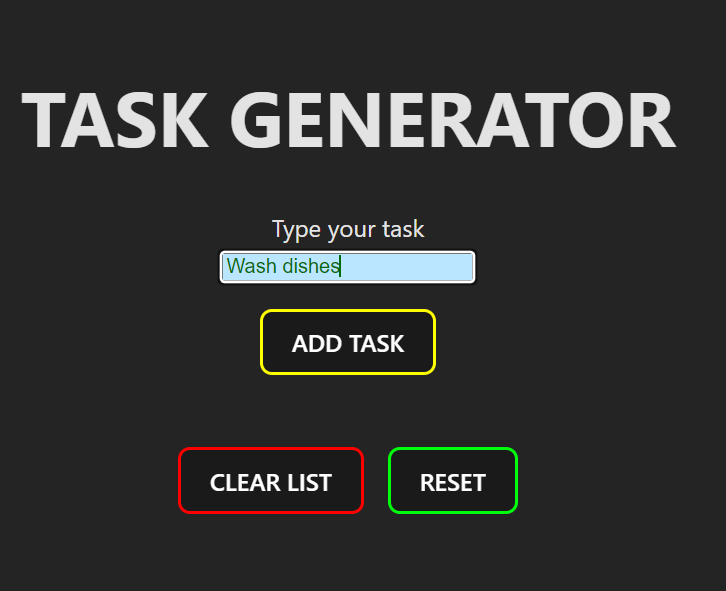
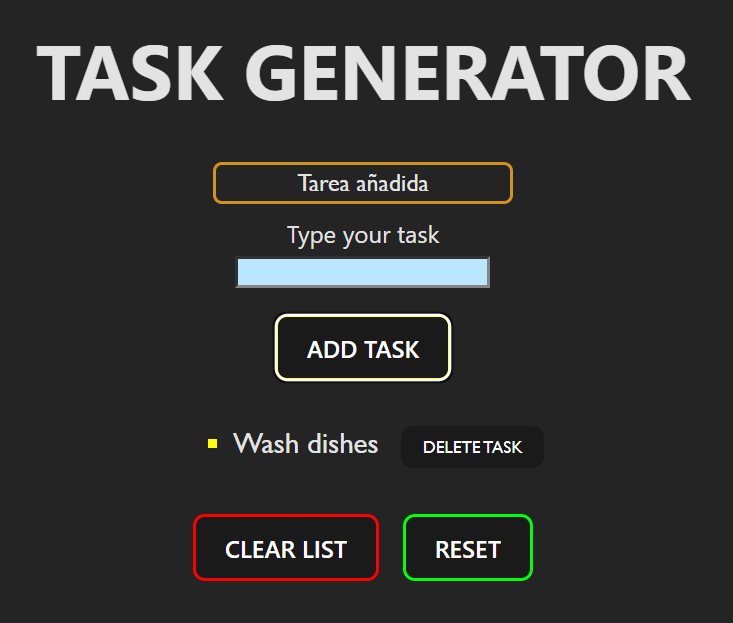
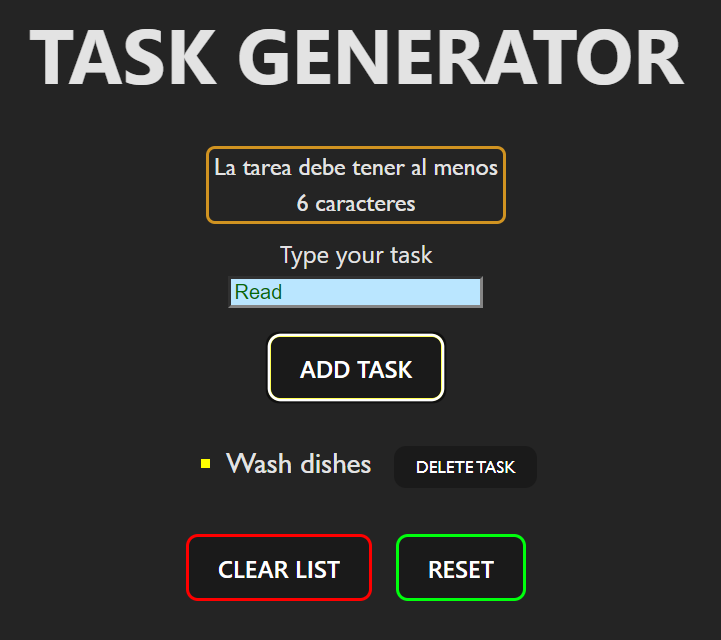

# REACT-Todo_List

TODO List realizada con REACT. Con el uso de los HOOKS useState y useEffect implementamos las siguientes funcionalidades:
-Input para introducir tarea.

-Botón de añadir tarea. Al hacer click, la tarea se agrega a la pantalla como lista.
-Validación de input. Una tarea debe tener más de carácteres, si no, se muestra mensaje y desaparece tras 3 segundos.

-Cuando una tarea es añadida, se muestra mensaje de confirmación y desaparece tras 3 segundos.

-Cada tarea añadida a lista, tiene, junto al texto, un botón de borrar tarea.

-Botón de borrar lista. Cuando se hace click, se borran todas las tareas agregadas hasta el momento.

-Botón de reseteo. Resetea la lista tal y como estaba antes de la ultima interacción (se haya añadido o borrado)